# Add a repo to quirq infra: onboarding quirq-ai/website

Guide for infra operators, 2026-10-05. Requested by suraj. It walks through
putting a new repo under quirq infra (qq), with its landing policy enforced,
using **quirq-ai/website** as the worked example. Each step says what you do,
who approves it, and the options you can change at that step.

Every screenshot is a real run on 2026-10-05: terminal output, config diffs,
the gate's own `verify` and `plan`, and the site itself. Steps that happen on
a GitHub or Vercel settings screen need an admin login, which the author of
this guide does not have. Those steps give the exact click path and a marked
spot, **Screenshot needed**, for an operator to fill in.

## Where website stands

| Step | What lands | Where | Status on 2026-10-05 |
|---|---|---|---|
| 1 | Read the repo's current state | GitHub API | Done (no rulesets, merge commits allowed) |
| 2 | Pick the kind, check the toolchain pin | your machine | Done (Gatsby, passes on Node 24.21.0) |
| 3 | The repo's manifest, `infra/repo.toml` | website PR | [website #1](https://github.com/quirq-ai/website/pull/1), draft, CI green |
| 4 | Registry entry, kind and builders | infra-config PR | Prepared and validated; with the infra-config owner |
| 5 | Generated workflows delivered into the repo | website PR | After step 4 merges |
| 6 | Rulesets and settings for the repo | gate PR | Prepared; with the gate owner, after step 5 |
| 7 | Apply the rulesets to GitHub | suraj's terminal | After step 6 |
| 8 | Optional: canary, rolls, code owners | several | Not started; see the options |

The order matters. infra-config must list the repo before gate can name it
(gate refuses settings whose product repos differ from infra-config's), and
the required check must exist on the repo's `main` before the apply will
touch it (gate's `verify` reports the repo NOT READY until then).

## Before you start

- **The repo exists, is public and is in quirq-ai.** On GitHub Free,
  rulesets and the merge queue work only on public repos, and qq accepts
  public repos only (`visibility = "public"` is the one value infra-config's
  schema allows).
- **It has the four org custom properties** that `vision/org/create-repos.sh`
  sets: `area`, `owner`, `owner-bot` and `stage`. Tools select repos by these
  properties, never by name.
- **You can run** git, Python 3.11 or newer, and Node and pnpm for a Node repo.
  Clone [infra-config](https://github.com/quirq-ai/infra-config),
  [gate](https://github.com/quirq-ai/gate) and
  [sync](https://github.com/quirq-ai/sync) beside the repo you onboard.

## Step 1: read the repo's current state

The repo is public, so the API answers without a login. Record what is there
before anything changes: its properties, its merge settings and its rulesets.

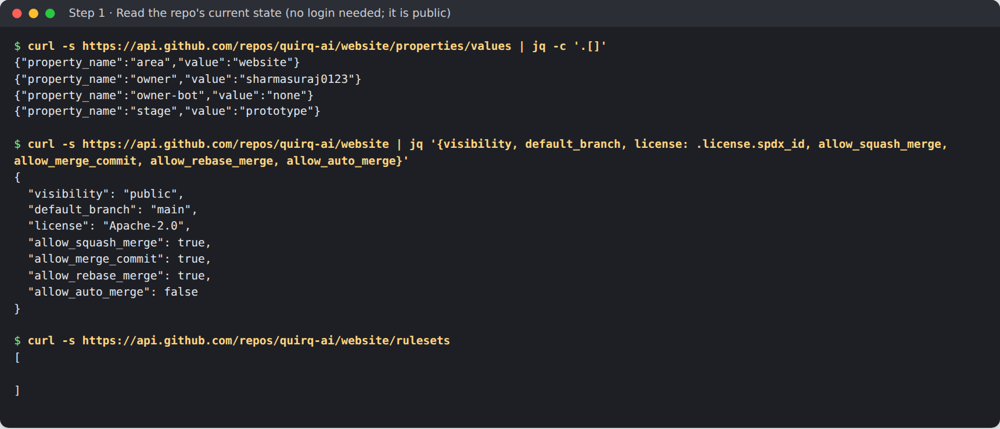

website starts with no rulesets, and merge, rebase and squash merges are all
allowed. Anyone with write access can push to `main`.

**Screenshot needed:** Org **Settings › Repository › Custom properties**, the
row for website (needs an org owner's login).

**Options at this step**

- **Fix a property value** in the org's custom properties screen above, or
  with `gh api -X PATCH repos/quirq-ai/website/properties/values` as an org
  owner. `owner-bot` stays `none` until per-area bots exist (decided after
  v0).
- **A private repo** cannot be onboarded today. Making it public, or moving
  the org to a paid plan, are both decisions for suraj.

## Step 2: pick the kind and check the toolchain pin

A **kind** says how a target is fetched, built, tested and deployed; it lives
in infra-config's `config/kinds.toml`. qq keeps **one pin per toolchain** for
the whole org: Python 3.14 and Node 24 (the current LTS, for Next.js 16).

Read the repo before you choose. website is a **Gatsby 4** site managed with
pnpm 10.23.0, and it said Node 22. None of the existing kinds fits it:

| Kind | Fits website? |
|---|---|
| `node-app` | No. Its test step runs `tsc --noEmit` over the inherited PostHog code, and its run and deploy steps run `next start`. |
| `static-docs` | No. It has no toolchain or commands, so no CI steps can be generated from it. |
| `python-service`, `pytest` | No. |
| `container-image` | No, and its phase is `later`, which infra-config refuses. |

So this onboarding adds a kind, `gatsby-site`, and moves website to Node 24.
First check that the repo's own checks pass on the org pin:

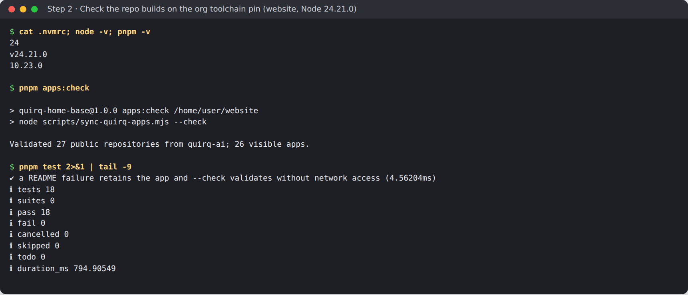

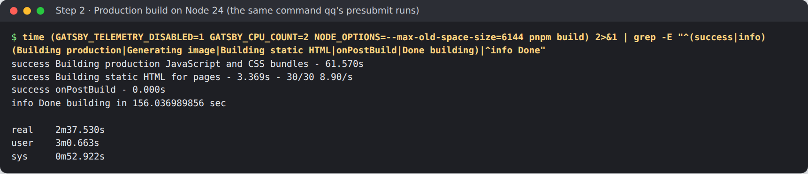

The build takes 2 min 37 s on this machine, well inside gate's 40-minute
limit for a required check. The built site, served locally:

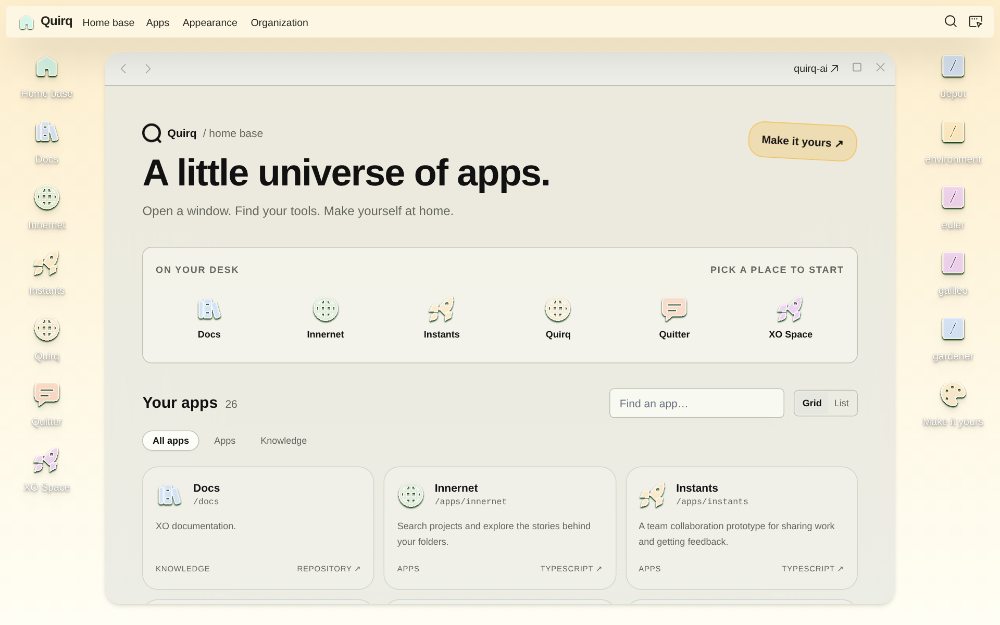

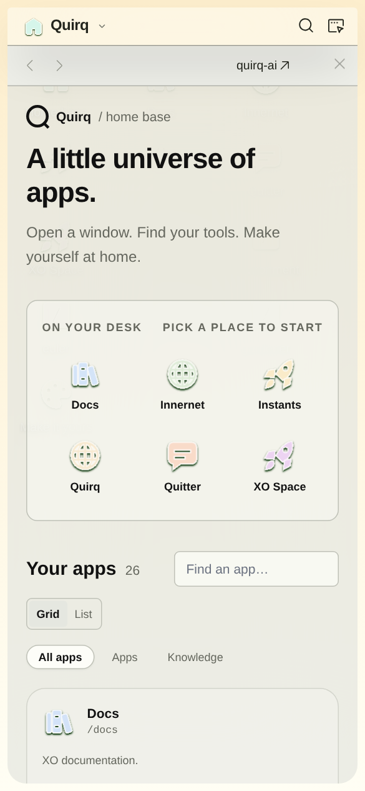

**Options at this step**

- **Reuse a kind** when one fits (a Next.js app with pnpm is `node-app`, a
  Python service is `python-service` plus `pytest`). Reusing one means no
  infra-config kind change and, if recipes has its adapter, `qq build` works
  locally on day one.
- **Add a kind**, as here. It needs interim commands in `kinds.toml` (what
  CI runs) and, later, an adapter in [recipes](https://github.com/quirq-ai/recipes)
  so `qq build` and `qq test` work on a laptop. Until that adapter exists,
  developers use the repo's own commands.
- **Keep a different toolchain version.** Not supported: a second Node pin
  would need a toolchain built and promoted in
  [toolchains](https://github.com/quirq-ai/toolchains) and is a policy change.
  If the repo fails on the org pin, fix the repo.

## Step 3: add the manifest to the repo

The manifest, `infra/repo.toml`, lists the repo's targets and pins its
toolchains. Only `qqsync` reads or edits it. website's has one target, `site`,
of kind `gatsby-site`, and the same Node 24.21.0 pin innernet uses (the one
toolchains promoted, by digest).

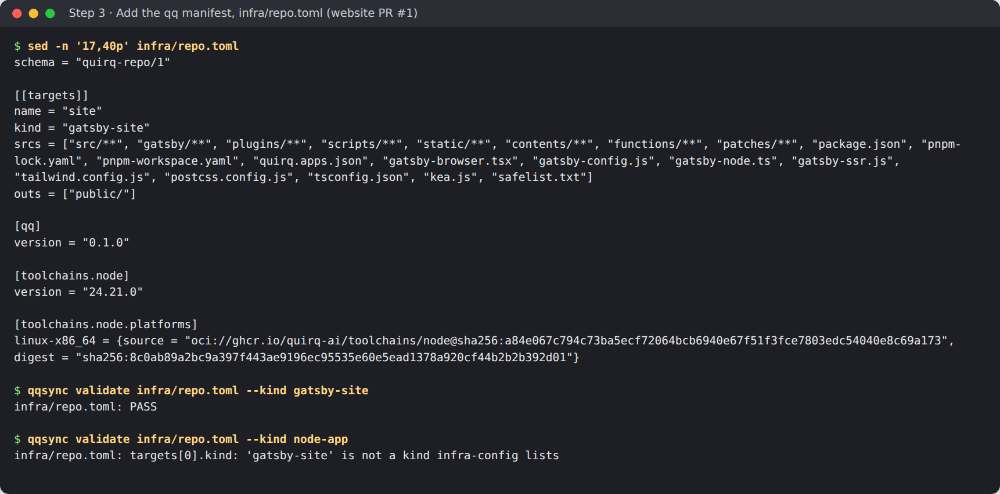

The second `qqsync validate` shows what happens when you name a kind
infra-config does not list. The same PR moves `.nvmrc`, `engines`, the
devcontainer, `validate.yml`, the README and AGENTS.md to Node 24. Its checks
pass, and Vercel's GitHub app builds a preview from it:

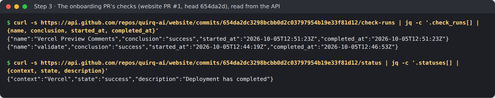

**Who approves:** this is product code in the repo; an agent opens the PR and
suraj (or the repo's owner) merges it. Until step 7 the repo has no gate, so
nothing stops a merge without green checks: wait for them.

**Options at this step**

- **More targets.** A repo with a site and a separate package lists one
  `[[targets]]` block each, each with its own kind.
- **`srcs` and `outs`** say which files a target reads and what it writes
  (`public/` for Gatsby). They feed caching and change detection later; list
  every input, including config files at the root.
- **`params`** pass kind-specific settings to the recipes adapter, such as
  `dir` and `ready_path` for `node-app`. `gatsby-site` has none yet.
- **The `[qq] version`** pins the qq tools the repo expects (0.1.0 here, like
  the other repos).

## Step 4: register the repo in infra-config

infra-config is the source of truth for what qq runs. Three files change:

- `config/kinds.toml`: the new kind, with its interim commands;
- `config/repos.toml`: one `[[repo]]` block for website;
- `config/pipelines.toml`: a blocking presubmit builder and a post-submit
  builder.

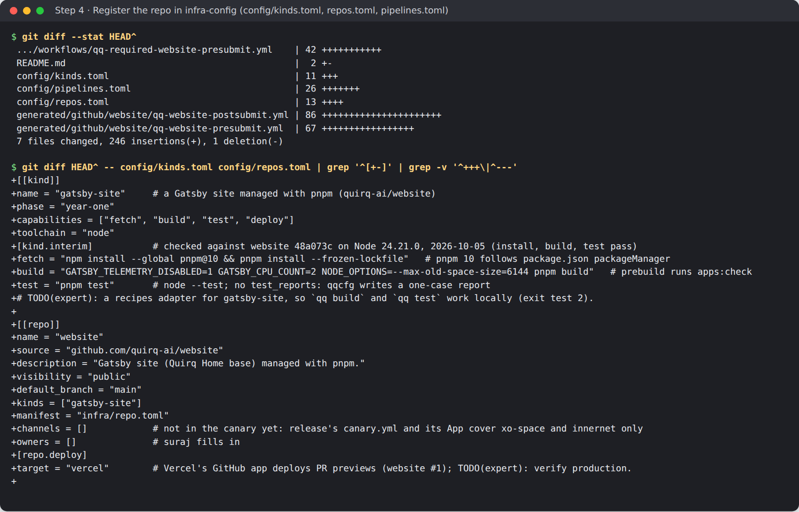

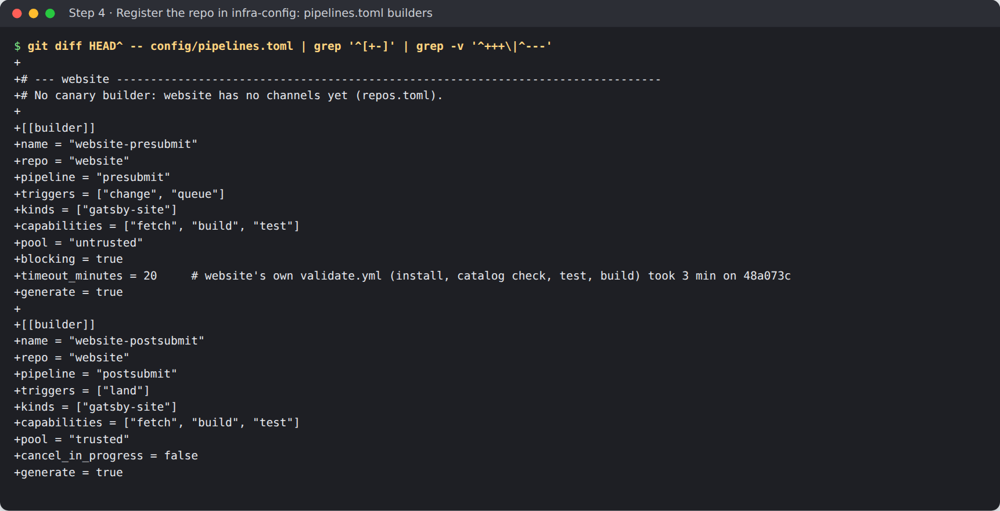

Then regenerate and validate. `generate` writes the repo's two workflow stubs
into `generated/github/website/` and an org-required copy of the presubmit
into `.github/workflows/`. `validate` checks every file against its schema and
against each other, and the unit tests must pass:

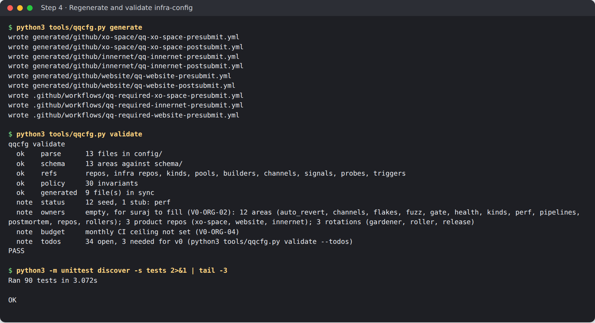

**Who approves:** infra-config's AGENTS.md classes everything under `config/`
as policy, so suraj approves the PR. Its required check is `validate`.

**Options at this step**

- **`channels`**: `[]` keeps the repo out of releases. `["canary", "dev",
  "stable"]` puts it on the release train, which needs more (step 8). The
  validator holds you to it:

  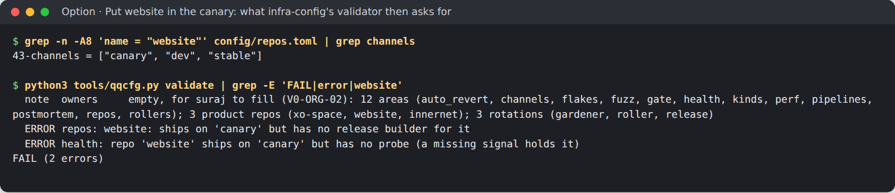

- **`deploy.target`**: where the repo ships. website says `vercel`, because
  Vercel's GitHub app deploys a preview of every website PR; the production
  target is still to verify.
- **`owners`**: leave `[]`. suraj fills in owners; agents never do.
- **`other_qq_workflows`**: list any `qq-*.yml` another quirq tool delivers
  into the repo (rollers' `qq-roll-land.yml`, for example) with its sha256.
- **Builder fields** in `pipelines.toml`:
  - `triggers`: `change` (pull request) and `queue` (merge queue) for the
    presubmit; `land` (push to main) for the post-submit.
  - `blocking = true` makes the presubmit the required check. Every repo needs
    exactly one blocking presubmit on `change` and `queue`, plus a post-submit
    mirror.
  - `timeout_minutes`: at most 40 for a blocking builder (gate admission).
    Aim for a typical run under 15. website's is 20 for a 3-minute job.
  - `pool`: `untrusted` (no secrets) for anything that runs a PR's code;
    `trusted` for post-submit and deploys.
  - `cancel_in_progress = false` on the post-submit, so every main commit
    gets a verdict and a culprit can be found.
- **Interim commands** in the kind: website's build sets
  `NODE_OPTIONS=--max-old-space-size=6144` and `GATSBY_CPU_COUNT=2`, as its own
  CI did. A kind's `test_reports` can name JUnit files for the result sink;
  without them, qq writes a one-case report from the test step's outcome.

## Step 5: deliver the generated workflows

Once the infra-config PR merges, copy the stubs from that commit into the repo
with `qqcfg deliver` and open a PR. `check-delivered` tells you whether a
checkout's stubs match infra-config:

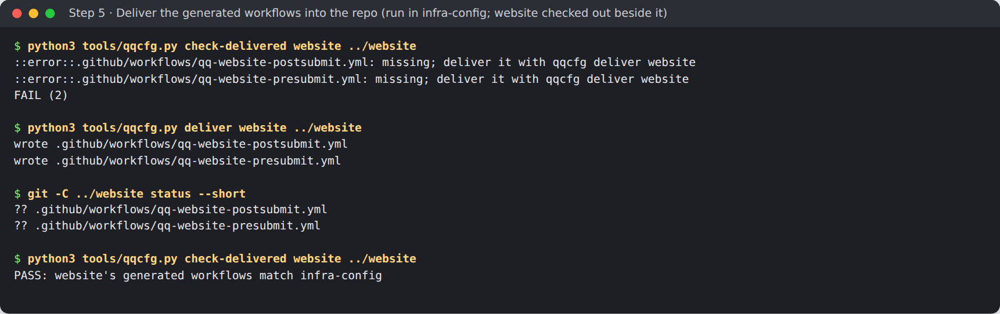

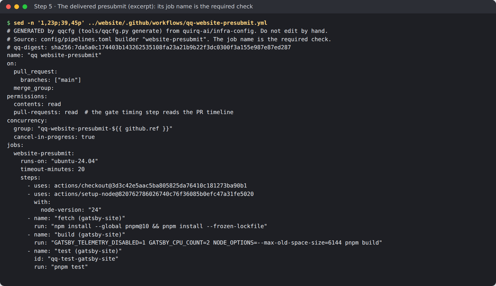

Each stub carries a `# qq-digest:` line and checks itself, so a hand edit
fails the build. Never edit a `qq-*.yml` in the repo: change infra-config and
deliver again.

**Who approves:** a product PR that only adds generated workflows; suraj
merges it.

**Options at this step**

- **Retire the old CI or keep it.** website's `validate.yml` runs the same
  catalog check, tests and build on pull requests, but not in the merge
  queue. The default is to delete it in the delivery PR, as xo-space did with
  its `tests.yml`. Keep it only if it checks something the presubmit doesn't;
  it then stays an extra check that is not required.
- **Redeliver after any builder change.** A stub that `main` of infra-config
  generated up to `drift_grace_days` (7) ago still passes the drift check with
  a warning.

## Step 6: add the repo to the gate

The gate turns `settings/github.toml` into GitHub rulesets. Add one
`[[repo]]` block with `kind = "product"`, and move `pins.toml`'s infra-config
commit to one that lists the repo. The repo's required checks are not listed
here: gate computes them from infra-config.

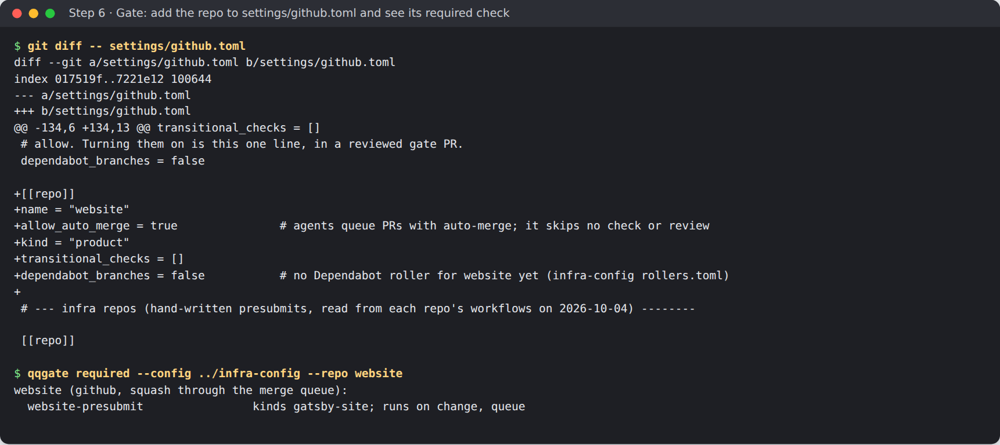

`qqgate settings verify` says which repos are safe to apply. Until the
delivery PR is on website's `main`, website is NOT READY, and an apply skips
it instead of wedging its merge queue:

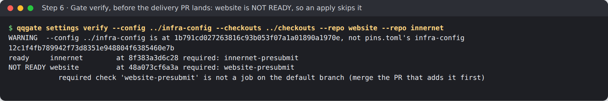

`qqgate settings plan` shows the rulesets an apply would create for website:
`qq-main` on the default branch (no deletion or force-push, pull requests with
0 approvals and squash only, the merge queue, and `website-presubmit`
required), plus the org-wide release-ref and reserved-tag rulesets:

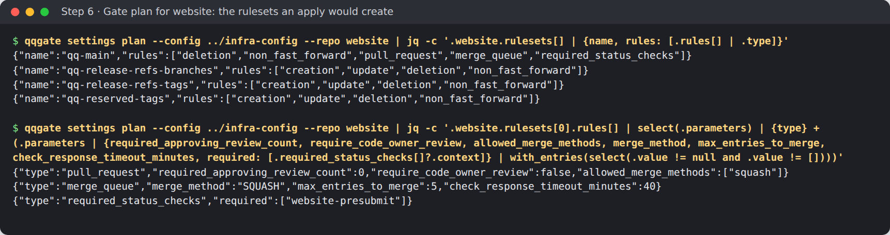

The WARNING line in these runs is expected: they used an unmerged infra-config
commit. The gate PR moves the pin, and the apply clones exactly that commit.

**Who approves:** gate is policy; suraj approves the gate PR, and only he
applies it (step 7).

**Options at this step** (per repo, in `settings/github.toml`)

| Setting | Default | What changing it does |
|---|---|---|
| `allow_auto_merge` | `true` | Agents queue PRs with auto-merge; it skips no check. `false` means PRs land only by a person's click, as xo-space chose. |
| `transitional_checks` | `[]` | Keeps an existing check required while you migrate. It must run on `pull_request` and `merge_group`, or `verify` refuses it; website's `validate.yml` does not. |
| `dependabot_branches` | `false` | Lets only Dependabot update its own PR branches. Turn on with a Dependabot roller (step 8). |
| `code_owner_review` | `false` | Requires a code owner's approval on owned paths. Needs a CODEOWNERS file; only toolchains uses it today. It is a policy change. |
| `queue_group_size` | 5 | How many PRs the merge queue tests together. 1 makes each PR land alone. |
| `state_branches`, `release_tags` | none | Protect branches a workflow writes to and tags only the release executor may create. |
| `allow_conditional` | none | Lets a required job skip under a stated condition, with a reason. |

Org-wide settings in the same file apply to every repo: squash merges, 0
required approvals and no bypass for anyone. Changing them is a policy
decision for suraj. The pinned org-required presubmit (`org_workflows`) is
off, because GitHub Free has no org rulesets.

## Step 7: apply (suraj)

Only an org admin can apply, and an agent never applies its own gate. suraj
runs one command from the gate commit that carries the change. Paste it from
any folder; it runs in a subshell and cleans up after itself:

```sh
( mkdir -p ~/qq-apply && cd ~/qq-apply && rm -rf qq-gate && git clone -q https://github.com/quirq-ai/gate qq-gate && cd ./qq-gate && git checkout -q <COMMIT> && scripts/apply.sh )
```

It clones infra-config at the pinned commit and every repo fresh, runs
`verify` and a dry run, and writes nothing until you type **yes**. The full
walk-through is gate's
[docs/apply-settings.md](https://github.com/quirq-ai/gate/blob/c3721365186a35c4b2b5acdc0635e281e754ac13/docs/apply-settings.md).

**Screenshot needed:** the apply run in suraj's terminal: the `verify` lines
with `ready website`, the dry run's `plan website: create ruleset qq-main`
line, and the `yes` prompt.

Afterwards, anyone can confirm it from the API:

```sh
( curl -s https://api.github.com/repos/quirq-ai/website/rulesets | jq -r '.[].name' )
```

It should list `qq-main`, `qq-release-refs-branches`, `qq-release-refs-tags`
and `qq-reserved-tags`.

**Screenshot needed:** website **Settings › Rules › Rulesets**, then
**qq-main**, showing the merge queue and the required check
`website-presubmit`.

**Screenshot needed:** website **Settings › General › Pull Requests**, showing
**Allow auto-merge** on.

**Options at this step**

- **Turn off the merge-commit and rebase buttons** in **Settings › General ›
  Pull Requests**. The ruleset already allows squash only, so this only tidies
  the merge button; gate does not manage those toggles.
- **Re-run any time.** The command is idempotent: rulesets are created or
  updated by name, and a ruleset edited on GitHub shows as `differs` and is
  replaced only after its own `yes`.

## Step 8: options after onboarding

None of these are needed for the repo to be gated. Each is a separate change.

### Put the repo in the daily canary

website is not in the canary yet; the release canary covers xo-space and
innernet. Adding it takes:

1. infra-config: `channels = ["canary", "dev", "stable"]` in `repos.toml`, a
   `website-canary-deploy` release builder (`generate = false`) in
   `pipelines.toml`, a health probe for website in `health.toml` (`/`,
   expecting 200), and website in the canary health signals' `repos` lists.
2. recipes: a `gatsby-site` adapter with a `deploy` step, because the probe
   runs against the canary test environment recipes' deploy starts.
3. release: website in `canary.yml`, and, once the release App exists,
   that App installed on website and website added to the repos the gate lets
   the release executor write refs in (the gate's draft release-App change
   lists xo-space and innernet). Promoting to stable stays suraj's decision.

### Dependency and toolchain rolls

Add website to the `node-deps` roller (Dependabot, weekly, at most 5 open
PRs) and the `toolchains` roller in infra-config's `rollers.toml`. rollers
then generates `.github/dependabot.yml` and `qq-roll-land.yml` for the repo,
and infra-config records `qq-roll-land.yml` under `other_qq_workflows`. Turn
on `dependabot_branches` in gate when the Dependabot rules are verified.
gate.toml's `dependency-roll` class needs no approval for a clean roll, but
rollers keeps Dependabot rolls from landing on their own until its land check
is cleared.

### Code-owner review

Add a `.github/CODEOWNERS` naming owners for the verification surface
(`infra/`, `.github/`, test files) and set `code_owner_review = true` in gate.
This is a policy change for suraj, and today only toolchains uses it.

### Local builds with `qq`

Write the `gatsby-site` adapter in recipes (fetch, build, test; run and
deploy with `gatsby serve`). Until then, `qq sync` fetches the Node pin but
`qq build` and `qq test` cannot run this target.

### Health, performance and fuzzing

`health.toml` signals (PostHog ones wait for v1), `perf.toml` benchmarks and
`fuzz.toml` schedules each take a `repos` entry once the repo has something
worth measuring.

## Sources

Checked on 2026-10-05 at these commits:

- website [48a073c](https://github.com/quirq-ai/website/tree/48a073cf6a3a75c3c975609de59ad5e52ebd116e)
  (main) and [PR #1](https://github.com/quirq-ai/website/pull/1) at b318e25 (its
  checks are shown at 654da2d, the first push).
- infra-config [310e326](https://github.com/quirq-ai/infra-config/tree/310e3264f5de3cd9822b3a4712ae0a372b97dac3):
  `config/`, `tools/qqcfg.py`, `AGENTS.md`; the website change is local commit
  1b791cd on top, not merged.
- gate [c372136](https://github.com/quirq-ai/gate/tree/c3721365186a35c4b2b5acdc0635e281e754ac13):
  `settings/github.toml`, `pins.toml`, `src/qqgate/settings.py`,
  `docs/apply-settings.md`.
- sync [d97e2f7](https://github.com/quirq-ai/sync/tree/d97e2f747cfa7dd04fac3cd8e9973eb7eab091dd):
  `qqsync validate`.
- recipes [db6ce0a](https://github.com/quirq-ai/recipes/tree/db6ce0a19ea0adb6bc71cd553524064bdd18d5b0)
  `src/qqrecipes/adapters/node_app/`.
- toolchains [44f8f95](https://github.com/quirq-ai/toolchains/tree/44f8f959458eab59baf46cbae5866a36657f7eeb)
  `promoted.toml`.
- GitHub REST API, read without a login: website's properties, settings,
  rulesets, check runs and statuses.
